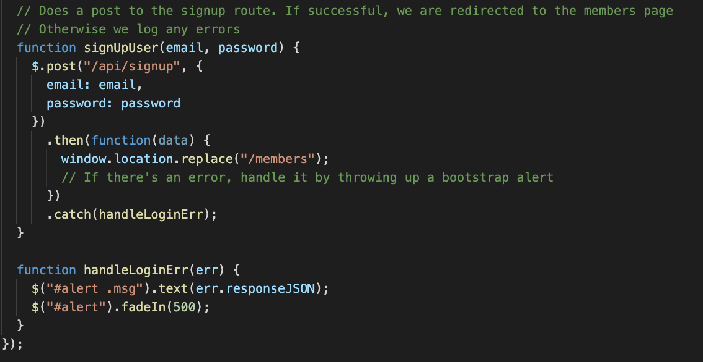

# ReverseEngineeringCode

This code in its current state is the framework for an application that uses user authentication to allow different users to sign in and access their personal information from a database which stores information for all users.

The app uses the sequelize npm package to interact with the SQL database, and uses express to set up a server that fields client requests. However, two other npm packages give the application its added functionality. Express-session stores session information for the server, and allows for user-specific information to persist through the session. The passport npm package provides middleware for authenticating a user and protecting certain routes from being accessed without login credentials.

These packages work together to produce an application which can only be accessed once the user is specified. This enables the application to provide information from the SQL database specific to the user, and thus allows us to build a multi-user application with simply a single SQL database.

Currently, the application only allows users to either create an account or sign in to an existing account and view their username on an HTML page. However, the framework allows for a much more complex application to be built with relative ease.

<br>
***

Below is a detailed description of each of the directories used in the application. Where applicable, they are listed in an order to match the flow of requiring and exporting modules in and out of files.

## Contents

* [Config Directory](#config-directory)
    * [config.json](#config.json)
    * [passport.js](#passport.js)
    * [middleware/isAuthenticated.js](#middleware/isAuthenticated.js)
* [Models Directory](#models-dictionary)
    * [index.js](#index.js)
    * [user.js](#user.js)
* [Routes Directory](#routes-directory)
    * [api-routes.js](#api-routes.js)
    * [html-routes.js](#html-routes.js)
* [Public Directory](#public-directory)
    * [style.css](#styles.css)
    * [signup.html/signup.js](#signup.html/signup.js)
    * [login.html/login.js](#login.html/login.js)
    * [members.html/members.js](#members.html/members.js)
* [server.js](#server.js)
* [package.json/package-lock.json](#package.json/package-lock.json)

* [Directions for Future Modification](#future-modification)

<br>
<br>

## CONFIG DIRECTORY

***

### config.json

The config.json file contains objects that give the different sequelize configuration environment from which application might be run. The object of interest is the 'development' object, which connects the application to the SQL database on one's local machine when the application is in the process of being built/modified.

### passport.js

This file contains our setup of the passport npm package which is used for user authentication in this application. We require 'passport' and 'Local Strategy', the packages which are required to use passport in this application. We also require our database from the models directory. The purpose of this is to get access to the 'User' model -- in order to authenticate a user when logging in, passport will need access to the SQL database of users. 

Passport runs on different 'strategies' for user authentication, and the Local Strategy entails the use of a username/password to sign in. The passport strategy function will take in a username and password. It will first use a basic sequelize `findOne` query to check if a user with the argument username exists in the database. It will call the `validPassword` method which belongs to the [User model](#user.js) to see if the entered password matches the user password. If either of these conditions is not met, the user will be notified. Otherwise, the authenticated user will be returned.


### middleware/isAuthenticated.js

This file contains a piece of custom middleware which will effectively restrict access to served html routes to only those who have logged in as a valid user. It is a function which will take in a request, response, and next function. The function will check that req.user exists. If the user has passed the [passport.js][#passport.js] login authentication, then req.user will be a truthy value, and `next()` will be called. This will direct the express router to move on to the next piece of middleware in processing the request. If request.user is empty and falsy, the request will be redirected to the login page, ending the request processing. 

We export this middleware, and it  will be integrated later on in the [server route](#html-routes.js) which is responsible for rendering the members page. This middleware will be inserted into the route, and it will stop a user from accessing the members page if they are not logged in.


<br><br>

***

## MODELS DIRECTORY

***

### index.js

The index.js file complements the [config.json](#config.json) file in sequelize's bre-built configuration. It's purpose is to create sequelize tables in the specified database from each file in the models directory.

This file requires the `fs`, `path`, and `sequelize` npm packages. It then instantiate a new instance of sequelize by grabbing onto the environment in which the code is being run (either deployed on a service like heroku or in development on a local machine) and creating a new Sequelize object with this information. Additionally, it create an empty object called `db`. This will be where we store our models.


Next, `readdirSync` reads in a list of every file within the models directory. This list is filtered so that it does not include any hidden files (which start with '.') or the index.js files, and all that is left are the .js files which contain our models. Within each model file, we are exporting a function which, when called on sequelize and DataType, will create a table in our sequelize database and return the object representing this table. For each of these model files, we call `sequelize['import']` on the exported function. This built in method of the sequelize instance calls the function which is exported from on the sequelize instance and the sequelize datatypes. The return values is the model object defined in the import model.js file. This object is added to out `db` object as a values with an associated key of the model name. We then iterate back through the list of database keys, and examine the 'associate' key of each model. If the model has any associations with other models, the index.js file creates the association in our sequelize database.

Finally, we add a key of 'sequelize' to our database, where the value is our sequelize instance. We also add a key of 'Sequelize', where the value is the sequelize standard library.


By exporting the db object, we can now access every single one of our models in any file which requires the models directory just by using `db.<model-name>`. This will be very helpful when creating our routes.

### user.js

Inside of the user.js file, we create a model of what a `User` row will be in the SQL database. We require the `bcriptjs` npm package, which we will use to hash the password that we store in the database. We then create a function which takes in two arguments: sequelize and DataTypes. These arguments will be automatically passed into this function after we import it in the [index.js](#index.js). This function will return the `User` object that we will use to interact with the users SQL table in the database.

The `User` object is defined with two columns:

* The 'email' column is a string which cannot be null, must be unique, and must be validated as a proper email by sequelize.
* The 'password' column is a string which cannot be null.


We then add two methods to the `User` object.

* The first is a basic object method. It will take in an entered password and compare it to the hashed password stored in the User object. This comparison occurs using the bcryptjs npm package's `compareSync` method, which returns a boolean that indicates if the entered password matches the hashed password.

* The second is a built in sequelize method, `addHook`. The first parameter, `beforeCreate`, signifies that this method will be carried out before an instance of the `User` object is created. The second argument is the function to be executed. This function will call a method of the bcryptjs packaged which converts the password attribute of the user to a hashed version for storage in the database. This will protect the password.


We return the user object out of the exported function. Sequelize will store this model in the database when the [index.js](#index.js) is run, and the `User` model will be accessible by the application.

<br><br>

***

## ROUTES DIRECTORY

***

### api-routes.js

At the top of the api-routes.js file, we require the models module as `db`. This will give us access to each of the models defined in the [models](#models-directory) module. We also require the passport.js file as `passport`. This is going to give us access to the authentication middleware which will help us to authenticate users.

Our first route is a post route corresponding to the user logging in. As seen in the [login.js](#login.html/login.gs) file, this route will have a request body that contains a username and password. There is a middleware function, `passport.authenticate('local')`, called in the api route. If the contained username and password are not authenticated by the passport middleware, there will be no user sent back in the res.json(req.user). Otherwise, a valid user object will be sent back in the response.


The second route is a post route corresponding to the user signing up. In the request will be sent a username and a password, and these will be passed into the `create` method of the sequelize `User` object to create a new user. If there are any errors, such as the username already being taken or the password not being valid, an error will be sent back in the response. Otherwise, the response using the new `User` object will be redirected to the above `/api/login` route to log the user in to the session.


We then have a logout route. This will call the passport method of `.logout()` on the current session. This ends the persistence of the user data carried in requests sent in the application. The user will have to login to the application again.


The final api route enables the user to get information about the user on the client side. If the user has not been authenticated and there is no user attribute in the request object, then no user data will be returned in the response. Otherwise, the client will be returned by the server some json with the user data in it.


All of these routes are exported as a runction which takes in `app` as an argument. In the [server.js](#server.js) file, we require this module and call the import on the express server, giving our server access to all these routes.

***

### html-routes.js

We require the `path` module so to effectively create specific paths to serve up files. We also require the `isAuthenticated` module. It is a small piece of [custom middleware](#middleware/isAuthenticated.js) which will be used in one of the routes below.

As in the [api-routes.js](#api-routes.js) file, we are exporting a functino which, when called on the express instane in the [server.js](#server.js) file, will give our server access to these routes. 

The first html route is a get request for the `'/'` root route. If the user has been authenticated and the request object is carrying with it a user object, then the page will redirect to the members page. Otherwise, the user will be sent the static signup html page.


The second html route is a get request for the `'/login'` route. Again, if the user is already logged in, and the request object is carrying with it a user object, the page will be redirected to the members page. Otherwise, the user will be served the static login html page.


The final html route is a get request for the `'/members'` route. Here, before we call the callback function to handle the request and the response, we insert our [`isAuthenticated` custom middleware function](#middleware/isAuthenticated.js) which was exported from the middleware directory. This function checks to see if the req.user key has a user object or not. If it does, then `next()` is called, and the request process continues. If req.user is empty, then the response will be redirected to the `'/'` route, which will display either the signup or login html pages.


<br><br>

## PUBLIC DIRECTORY

The public directory is declared a static file in the [server.js](#server.js) file. This means that the entire application has access to these files while it is deployed.
***

### style.css

The style.css file contains stylings for the static HTML page. So far, it only contains stylings for the login and signup forms.

### signup.html/signup.js

The signup html page is a basic input field where the user can enter a username and password. On the client-side javascript, we first examine the `signUpUser` function. It takes in a username and password as arguments, and creates a post request to the [`'/api/signup'`](###api-routes.js) route. This will send the user's new signup data to be added to the database as a new profile. If there is an error, a boostrap error will be thrown using the `handleLoginError` function.



The signup.js file has a simple event listener which captures the signup information of the user to and calls the `signUpUser` function with this information as the arguments.


### login.html/login.js

Similary to the signup.html file, the login.js file is a simple input field where the user can enter login information. This file relies on the `loginUser` function. It makes a POST request to the [`'api/login'`](###api-routes.js) function, sending the input email and password as data. The api route using the `passport.authenticate('local')` middleware to verify that the credentials are valid, and the user is either given an error or directed to the members page.


The login.js event listener setup is identical to that in the [signup.html](signup.html/signup.js) file.

### members.html/members.js

The members page is very simple. The javascript file submits a get request to [`'/api/user_info'`](###api-routes.js). This data is returned, and the javascript parses out the user email for display on the html.


<br><br>

***

### server.js

The server.js file initializes our express server. First, we require our files and set the port that we will be listening on:

* 'express' is the npm package that creates our server.
* 'express-session' is the npm package that allows our server to store the session data which will facilitate user persistence.
* 'passport' is the npm package which facilitates user authentication.
* We establish that our server will listen on either the port specified by process.env during deployment, or on port 8080 if the server is being hosted on the local machine.


We then create out instance of the express server, and equip it with the tools necessary for this application.

* We assign the variable `app` to the instance of the express server we create.
* We tell app to use the `express.urlencoded` middleware with the extended option equal to true. This allows nested json objects to be sent in url requests to the server.
* We tell app to use the `express.json` middleware, which works with urlencoded to facilitate json data in request.
* We mount the 'public' folder as static in our application so that it can be accessed.
* We initialize the express-session `session` on our app:
    * The 'secret' option is the signature on the session cookie
    * The 'resave' and 'saveUnitialized' options ensure that all sessions are saved.

* We initialize passport for user authentication
* The passport.session() adds the user information to the req body, and allows us to access it persistently throught the application session.


We then require the two files in the [route directory](#routes). These files export functions which, when called on app, give app access to these routes.

Finally, we sync our application with the SQL databse using the promisified `db.sequelize.sync()`, and then make the app start listening on specified port.


### package.json/package-lock.json

The package.json file and package-lock.json files contain the dependencies that this application requires from npm. To install all of the dependencies in this file, navigate into this directory in terminal and run:
```
npm install
```

<br><br>
***

## Future Modification

The skeleton code provided in these files can now be modified so that the SQL database can store more data for each user. We want to maintain the association between all data and the user so that we can select which data to serve to the client based on the current user's credentials. To do so:

1. Create New Models

For any new table that you would like to use for data storage in the SQL database, create a new `<model-name>.js` file in the models directory. Using the template structure found in the user.js file, write code to create your new table with all the necessary columns. See the [sequelize documentation on model basics](https://sequelize.org/master/manual/model-basics.html) for detailed instructions.

2. Create Associations

For each table, we want to create an association with the user who creates the table. To do so, we want to make a relation where each table model BELONGS TO one user, and each user HAS ONE or HAS MANY models for the rows in each table. See the [sequelize documentation on associations](https://sequelize.org/master/manual/assocs.html) to see how to create these associations.

3. Add the UserId to queries in your application

When you make any kind of query in the database, you will want to only gather the information that corresponds to the user who is logged in. If you created the associations above in step 2, then this is as easy as adding a "WHERE" condition to your query/

* If you are making a query into the SQL database on the server side, you can access the current user's id using `req.user.id`. Then, in you sequelize query, include the following where condition:
```
where: {userId: req.user.id}
```
See the [sequelize documentation on querying](https://sequelize.org/master/manual/model-querying-basics.html) for more guidance on querying with where statements.
* If you are making a query into the SQL databse on the client side, you can use the [`'api/user_data'` route](#api-routes.js) to gain access to the the user information. In the response to this request, you can access the user id by looking up the key of `id` on the response object.


### Now, you are ready to begin building your multi-user application!


